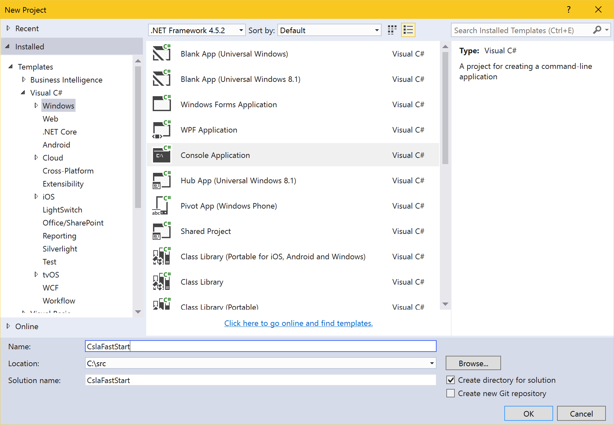
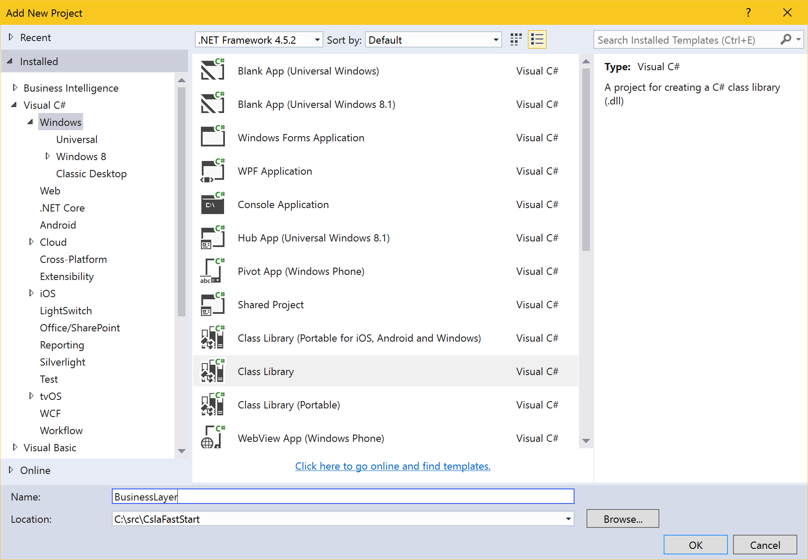

# CSLA .NET Fast Start
The focus of CSLA .NET is on the creation of a reusable business logic layer for applications. That layer consists of business domain objects created using object-oriented design concepts.

Of course using this business domain layer requires some sort of interface (human or API). And in most cases the state of the domain objects must be persisted via some sort of data access layer.

CSLA .NET is based on a five layer architecture:

1. Interface layer
2. Interface control layer
3. Business layer
4. Data access layer
5. Data storage layer

This fast start will walk you through the creation of all five layers in the simplest manner possible. The interface will be a console app, and the data storage will be a collection in memory.

The fact that this fast start doesn't use IoC/DI or other advanced/modern programming concepts doesn't mean they aren't supported. But adding in myriad other frameworks and technologies would prevent this from being a _fast_ start.

Similarly, the fact that this code doesn't include a data access layer that interacts with a database, remote service, file on disk, Excel spreadsheet, or any other type of data storage doesn't mean they can't all be used. As you'll see, you are in total control of the code in the data access layer.

For more detailed information about using CSLA .NET please see the [Using CSLA .NET](http://store.lhotka.net/using-csla-4-all-books) book.

## Creating the solution and Interface project
Open Visual Studio and create a new _Console Application_ using the full .NET framework. Name it `CslaFastStart`.



Add a NuGet reference to the `CSLA-Core` package to your console app project.

## Creating the Business layer project
Add a new _Class Library_  project to the existing solution. Name it `BusinessLayer`.



Add a NuGet reference to the `CSLA-Core` package to your class library project.

Return to your console app project and add a project reference to your new `BusinessLayer` project.

## Creating the Data access layer project
Add a new _Class Library_  project to the existing solution. Name it `DataAccessLayer`.


Return to your `BusinessLayer` project and add a project reference to your new `DataAccessLayer` project.

## Adding a business domain class
Open the `BusinessLayer` project and rename `Class1` to `PersonEdit`. Then update its code as follows:

```csharp
using System;
using Csla;

namespace BusinessLayer
{
  [Serializable]
  public class PersonEdit : BusinessBase<PersonEdit>
  {
    public static readonly PropertyInfo<int> IdProperty = RegisterProperty<int>(c => c.Id);
    public int Id
    {
      get { return GetProperty(IdProperty); }
      private set { LoadProperty(IdProperty, value); }
    }

    public static readonly PropertyInfo<string> FirstNameProperty = RegisterProperty<string>(c => c.FirstName);
    public string FirstName
    {
      get { return GetProperty(FirstNameProperty); }
      set { SetProperty(FirstNameProperty, value); }
    }

    public static readonly PropertyInfo<string> LastNameProperty = RegisterProperty<string>(c => c.LastName);
    public string LastName
    {
      get { return GetProperty(LastNameProperty); }
      set { SetProperty(LastNameProperty, value); }
    }
  }
}
```

This is a typical, albiet very simple, business class which supports public read-write properties that can have business rules associated with them.

## Implementing persistence
Before the `PersonEdit` class can be used you must add the ability for an instance to be created, retrieved, updated, or deleted.

Open the `DataAccessLayer` project and rename `Class1` to `PersonDto`. Then change its code as follows:

```csharp
namespace DataAccessLayer
{
  public class PersonDto
  {
    public int Id { get; set; }
    public string FirstName { get; set; }
    public string LastName { get; set; }
  }
}
```

This code provides a way to pass entity state between the domain object and the data access layer without any coupling to specific data access technologies or platforms.

Now add a new class to the `DataAccessLayer` project named `PersonDal` with the following code:

```csharp
using System;
using System.Linq;
using System.Collections.Generic;

namespace DataAccessLayer
{
  public class PersonDal
  {
    // this is our in-memory database
    private static List<PersonDto> _list = new List<PersonDto>();

    public PersonDto Create()
    {
      return new PersonDto { Id = -1 };
    }

    public PersonDto GetPerson(int id)
    {
      var entity = _list.FirstOrDefault(_ => _.Id == id);
      if (entity == null)
        throw new Exception("Index not found");
      return entity;
    }

    public int InsertPerson(PersonDto data)
    {
      var newId = 1;
      if (_list.Count > 0)
        newId = _list.Max(_ => _.Id) + 1;
      data.Id = newId;
      _list.Add(data);
      return newId;
    }

    public void UpdatePerson(PersonDto data)
    {
      var entity = GetPerson(data.Id);
      entity.FirstName = data.FirstName;
      entity.LastName = data.LastName;
    }

    public void DeletePerson(int id)
    {
      var entity = GetPerson(id);
      _list.Remove(entity);
    }
  }
}
```

This class implements the basic operations needed in any data access layer. Rather than persisting the data into a database or file, it simply maintains the data in an in-memory `static` collection.

Now that the data access layer exists the `PersonEdit` business class can be enhanced to use this functionality. Open the `PersonEdit` class in the `BusinessLayer` project and add the following code to the class after the property declarations:

```csharp
using System;
using Csla;
using DataAccessLayer;

namespace BusinessLayer
{
  [Serializable]
  public class PersonEdit : BusinessBase<PersonEdit>
  {
    // ... existing property declarations ...

    protected override void DataPortal_Create()
    {
      var dal = new PersonDal();
      var dto = dal.Create();
      using (BypassPropertyChecks)
      {
        Id = dto.Id;
        FirstName = dto.FirstName;
        LastName = dto.LastName;
      }
      BusinessRules.CheckRules();
    }

    private void DataPortal_Fetch(int id)
    {
      var dal = new PersonDal();
      var dto = dal.GetPerson(id);
      using (BypassPropertyChecks)
      {
        Id = dto.Id;
        FirstName = dto.FirstName;
        LastName = dto.LastName;
      }
    }

    protected override void DataPortal_Insert()
    {
      var dal = new PersonDal();
      using (BypassPropertyChecks)
      {
        var dto = new PersonDto
        {
          FirstName = this.FirstName,
          LastName = this.LastName
        };
        Id = dal.InsertPerson(dto);
      }
    }

    protected override void DataPortal_Update()
    {
      var dal = new PersonDal();
      using (BypassPropertyChecks)
      {
        var dto = new PersonDto
        {
          Id = this.Id,
          FirstName = this.FirstName,
          LastName = this.LastName
        };
        dal.UpdatePerson(dto);
      }
    }

    private void DataPortal_Delete(int id)
    {
      var dal = new PersonDal();
      using (BypassPropertyChecks)
      {
        dal.DeletePerson(id);
      }
    }

    protected override void DataPortal_DeleteSelf()
    {
      DataPortal_Delete(Id);
    }
  }
}

```

The CSLA .NET data portal invokes a set of methods (shown in this code) depending on the current state of the business object and the type of operation requested by the calling code in the interface layer. The methods shown here bridge between the operation requested by the data portal, and the data access layer that implements the appropriate data storage interaction.

In a more sophisticated app these `DataPortal_XYZ` methods will typically use dependency injection or a provider model to dynamically load the appropriate concrete implementation of a data access layer based on the needs of your application.

At this point the business layer and data access layer are complete.

## Implementing the user interface
Open the `CslaFastStart` console app project's `Program.cs` file.

First, let's write code to create and insert a person:

```csharp
using BusinessLayer;
using System;

namespace CslaFastStart
{
  class Program
  {
    static void Main(string[] args)
    {
      Console.WriteLine("Creating a new person");
      var person = Csla.DataPortal.Create<PersonEdit>();
      Console.Write("Enter first name: ");
      person.FirstName = Console.ReadLine();
      Console.Write("Enter last name: ");
      person.LastName = Console.ReadLine();
      if (person.IsSavable)
      {
        person = person.Save();
        Console.WriteLine("Added person with id {0}. First name = '{1}', last name = '{2}'.", person.Id, person.FirstName, person.LastName);
      }
      else
      {
        Console.WriteLine("Invalid entry");
        foreach (var item in person.BrokenRulesCollection)
          Console.WriteLine(item.Description);
        Console.ReadKey();
        return;
      }

      Console.ReadKey();
    }
  }
}
```

Notice the use of the `DataPortal.Create` method to create and initialize a new instance of the domain object. Also notice now the `DataPortal.Save` method returns a new instance of the domain object. This new object instance contains the updated `Id` value that was generated by the data access layer.

Also notice how the domain object's `IsSavable` property is used to determine whether the object can be saved. Normally if it can't be saved it is due to broken business rules, and this code shows one way to list all the broken rules that make the object invalid.

Add the following code to retrieve and update an existing domain object:

```csharp
using BusinessLayer;
using System;

namespace CslaFastStart
{
  class Program
  {
    static void Main(string[] args)
    {
      // ... code to create and insert a person ...
      
      Console.WriteLine();
      Console.WriteLine("Updating existing person");
      person = Csla.DataPortal.Fetch<PersonEdit>(person.Id);
      Console.Write("Update first name [{0}]: ", person.FirstName);
      var temp = Console.ReadLine();
      if (!string.IsNullOrWhiteSpace(temp))
      {
        person.FirstName = temp;
      }
      Console.Write("Update last name [{0}]: ", person.LastName);
      temp = Console.ReadLine();
      if (!string.IsNullOrWhiteSpace(temp))
      {
        person.LastName = temp;
      }
      if (person.IsSavable)
      {
        person = person.Save();
        Console.WriteLine("Updated person with id {0}. First name = '{1}', last name = '{2}'.", person.Id, person.FirstName, person.LastName);
      }
      else
      {
        if (person.IsDirty)
        {
          Console.WriteLine("Invalid entry");
          foreach (var item in person.BrokenRulesCollection)
            Console.WriteLine(item.Description);
          Console.ReadKey();
          return;
        }
        else
        {
          Console.WriteLine("No changes, nothing to save");
        }
      }

      Console.ReadKey();
    }
  }
}
```

This code uses `DataPortal.Fetch` to retrieve an existing object, and then calls the `Save` method to save any changes. The CSLA .NET framework manages the metastate for each object, so it knows whether the object needs to be inserted or updated.

Not only can an object be not savable because it is invalid, but if an object has no changed values then there'd be nothing to save. This new code uses the `IsDirty` property to determine if the object was changed or is invalid due to broken rules.

Finally, add the following code to delete the data related to a domain object:

```csharp
using BusinessLayer;
using System;

namespace CslaFastStart
{
  class Program
  {
    static void Main(string[] args)
    {
      // ... code to create and insert a person ...

      // ... code to fetch and update a person ...

      Console.WriteLine();
      Console.WriteLine("Deleting existing person");
      Csla.DataPortal.Delete<PersonEdit>(person.Id);
      try
      {
        person = Csla.DataPortal.Fetch<PersonEdit>(person.Id);
        Console.WriteLine("Person NOT deleted");
      }
      catch
      {
        Console.WriteLine("Person successfully deleted");
      }

      Console.ReadKey();
    }
  }
}
```

At this point you should be able to run the app, seeing how it adds, updates, and deletes the data associated with a business domain object.

## Adding business rules
One of the primary features of CSLA .NET is the rules engine that sits within the `BusinessBase` type. The rules engine is very powerful and estensible, and this fast start will only touch on the simplest validation rule concepts. Beyond this are complex validation rules, calculation and data manipulation rules, authorization rules, and much more.

CSLA .NET supports the `System.ComponentModel.DataAnnotations` attributes. These provide a very simple and limited validation rule concept that works on any platform and behind any type of interface, because the attributes are automatically integrated into the broader CSLA .NET rules engine.

In the `BusinessLayer` project, add a reference to `System.ComponentModel.DataAnnotations` assembly. Then open the `PersonEdit` class and add a `using` statement:

```csharp
using System.ComponentModel.DataAnnotations;
```

Now it is possible to add the `Required` attribute to the `FirstName` and `LastName` properties:

```csharp
    public static readonly PropertyInfo<string> FirstNameProperty = RegisterProperty<string>(c => c.FirstName);
    [Required]
    public string FirstName
    {
      get { return GetProperty(FirstNameProperty); }
      set { SetProperty(FirstNameProperty, value); }
    }

    public static readonly PropertyInfo<string> LastNameProperty = RegisterProperty<string>(c => c.LastName);
    [Required]
    public string LastName
    {
      get { return GetProperty(LastNameProperty); }
      set { SetProperty(LastNameProperty, value); }
    }
```

If you now run the app and don't enter values for the first and last name properties during the first _create_ phase, you'll find that the object won't save because it is invalid, and you should see the broken rules listed as you'd expect.