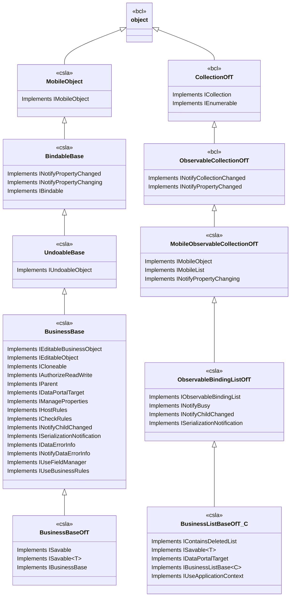

# Inheritance Hierarchy: BusinessBase vs BusinessListBase

This diagram compares the inheritance hierarchies of `BusinessBase` and `BusinessListBase`, ignoring interfaces.

```mermaid
%% Legend:
%% [csla] = in your codebase
%% [bcl] = .NET BCL
%% [nuget] = NuGet package

classDiagram
    object <|-- MobileObject
    class object {<<bcl>>}
    class MobileObject {<<csla>>
        Implements IMobileObject
    }

    MobileObject <|-- BindableBase
    class BindableBase {<<csla>>
        Implements INotifyPropertyChanged
        Implements INotifyPropertyChanging
        Implements IBindable
    }
    BindableBase <|-- UndoableBase
    class UndoableBase {<<csla>>
        Implements IUndoableObject
    }
    UndoableBase <|-- BusinessBase
    class BusinessBase {<<csla>>
        Implements IEditableBusinessObject
        Implements IEditableObject
        Implements ICloneable
        Implements IAuthorizeReadWrite
        Implements IParent
        Implements IDataPortalTarget
        Implements IManageProperties
        Implements IHostRules
        Implements ICheckRules
        Implements INotifyChildChanged
        Implements ISerializationNotification
        Implements IDataErrorInfo
        Implements INotifyDataErrorInfo
        Implements IUseFieldManager
        Implements IUseBusinessRules
    }
    BusinessBase <|-- BusinessBaseOfT
    class BusinessBaseOfT {<<csla>>
        Implements ISavable
        Implements ISavable~T~
        Implements IBusinessBase
    }

    object <|-- CollectionOfT
    class CollectionOfT {<<bcl>>
        Implements ICollection
        Implements IEnumerable
    }
    CollectionOfT <|-- ObservableCollectionOfT
    class ObservableCollectionOfT {<<bcl>>
        Implements INotifyCollectionChanged
        Implements INotifyPropertyChanged
    }
    ObservableCollectionOfT <|-- MobileObservableCollectionOfT
    class MobileObservableCollectionOfT {<<csla>>
        Implements IMobileObject
        Implements IMobileList
        Implements INotifyPropertyChanging
    }
    MobileObservableCollectionOfT <|-- ObservableBindingListOfT
    class ObservableBindingListOfT {<<csla>>
        Implements IObservableBindingList
        Implements INotifyBusy
        Implements INotifyChildChanged
        Implements ISerializationNotification
    }
    ObservableBindingListOfT <|-- BusinessListBaseOfT_C
    class BusinessListBaseOfT_C {<<csla>>
        Implements IContainsDeletedList
        Implements ISavable~T~
        Implements IDataPortalTarget
        Implements IBusinessListBase~C~
        Implements IUseApplicationContext
    }
```
