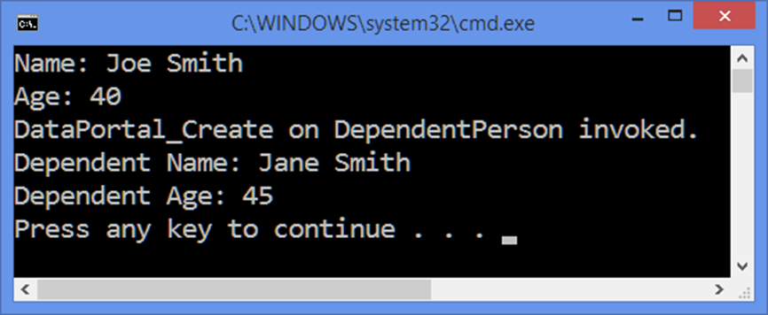

# Abstractions in CSLA

By Jason Bock

> Note: This content applies to CSLA 4, not to CSLA 5 or later.

## “Why don’t we create interfaces for CSLA?”

Back in 2008 I was an architect on a team of about 10 developers work on a Windows application using WPF. We were using MVVM in the presentation layer, we were using ADO.NET interface references in our BOs rather than direct implementations, and we had a good set of unit tests. In short, things were moving along well. But there was one part of the system that was bothering me, which was our business object layer. We were using CSLA, and while CSLA provided a lot of functionality for us, it wasn’t very friendly in two areas:

* We couldn’t create interfaces for our BOs that CSLA would respect across the board. For example, while we could create a IPerson interface for a Person BO that would define the properties and methods that Person should implement, there weren’t core interface stereotypes in CSLA like there were for the core BO types (e.g. BusinessBase). Because of this, we couldn’t pass around IPerson like it was a BusinessBase (or, ideally, an IBusinessBase interface).
* We couldn’t inject dependencies in a clean way. Because of how CSLA creates and handles BOs, we didn’t have a clear strategy around getting dependencies injected into our BOs. What we ended up with was a global inversion of control (IoC) container floating around in our code, and we’d reference that directly in the BOs. This worked, but it felt messy.

Initially I thought this wouldn’t be a big deal. Most every project I’ve worked on always has some dark corner or muddy area that doesn’t quite fit into the rest of the design. Most of the time, using workarounds, though not elegant, is sufficient. However, as the project moved on, it became evident that the BO layer was getting to be a sore spot. For example, view model tests ended up having 2 layers of dependencies because we couldn’t provide an abstraction for the BOs, so they were bloated and complex.

I wasn’t the only one that was noticing this. I distinctly remembering having a conversation about the overall design of the application with the team, specifically with the UI layer and injecting dependencies. One of our then junior developers asked the question that is the heading of this section. I wanted to provide a good answer … and I couldn’t! That really bothered me. It was a simple question that should have been simple to answer, but given the structure and design of CSLA at the time, it was pretty difficult to do. So much so that two things happened because of that question:

* I wanted to find ways to make CSLA easier to work with in loosely coupled systems, both in providing abstractions for the BOs as well as injecting dependencies.
* I remembered the name of the developer who asked the question: Jeff Angelini. He’s still with Magenic, and I still occasionally remind him that his one question that day stuck with me for years!

Over the years, I brought these issues up to Rocky Lhotka (the CSLA guy), and I’m happy to say that it’s now pretty easy to address the issues I ran into years ago. This article will show you how.

## New Interfaces in CSLA

CSLA has been around for a long time in the Microsoft developer world. It first started in VB before .NET, and when that runtime came into the picture, CSLA was ported to work there as well. However, in its initial stages, concepts like unit testing weren’t pervasive in the .NET community, let alone ideas like dependency injection. Over the years, CSLA has adapted to “play nice” in modern systems. Here’s what you should focus on for this article:

* Core stereotypes. Interfaces like IBusinessBase have been created for each of the core stereotypes, like BusinessBase (which implements IBusinessBase).
* IDataPortalActivator. This interface allows you to have control over the BO lifecycle

> Note: I’m using the latest version of CSLA, which at the time this article was written was 4.5.500. If you use anything older, some of these interfaces or members on the interfaces won’t exist. Also, I’m using VS 2013 targeting .NET 4.5.1 for the code samples, though .NET 4.5 or 4.0 should also work without issues.

Through the rest of the article, I’ll walk you through an example that will demonstrate how you tie things together. Let’s start by creating a simple BO and see how interfaces come into play.

## Creating Interfaces for BOs

The first thing I’ll do is create an IPerson interface. This has two editable properties on it: Age and Name. To do this, I’ll use IBusinessBase in an indirect manner:

```c#
public interface IBusinessBaseCore
	: IBusinessBase { }

public interface IPerson
	: IBusinessBaseCore
{
	uint Age { get; set; }
	string Name { get; set; }
}
```

I create a custom version of IBusinessBase called IBusinessBaseCore. When you’re using CSLA, it’s good practice to create your own base stereotypes that descend from the CSLA stereotypes you’re using. That way, if you want all your business objects to act in a similar fashion, you have the option of using the base class to do that. You don’t have to do this, but again, I recommend that you do. It’s been beneficial to do so on the projects I’ve been on that use CSLA. The key point to take away here is that all of your BO interfaces will descend from IBusinessBase, which BusinessBase implements. Therefore, I now have an interface foundationally supported by CSLA.

Here’s the implementation of IPerson – the Person class (along with BusinessBaseCore):

```c#
[Serializable]
internal abstract class BusinessBaseCore<T>
	: BusinessBase<T>, IBusinessBaseCore
	where T : BusinessBaseCore<T>
{
	protected BusinessBaseCore()
		: base() { }
}

[Serializable]
internal sealed class Person
	: BusinessBaseCore<Person>, IPerson
{
	public static readonly PropertyInfo<uint> AgeProperty =
		PropertyInfoRegistration.Register<Person, uint>(_ => _.Age);
	public uint Age
	{
		get { return this.GetProperty(Person.AgeProperty); }
		set { this.SetProperty(Person.AgeProperty, value); }
	}

	public static readonly PropertyInfo<string> NameProperty =
		PropertyInfoRegistration.Register<Person, string>(_ => _.Name);
	public string Name
	{
		get { return this.GetProperty(Person.NameProperty); }
		set { this.SetProperty(Person.NameProperty, value); }
	}
}
```

If you’ve ever created a CSLA-based BO before, you’ll notice that the Person definition is pretty mundane. The main difference is adding the IPerson interface. I’ve also made it internal because it enforces the notion that users of the BO should be using the interface, not the implementation. Later on I’ll cover how a user actually gets an instance of Person. 

There’s one other difference. You may notice that I’m not registering the managed backing field with the typical “Person.RegisterProperty” syntax. The reason is that I’ve found CSLA to be kind of a pain to work with in inheritance scenarios. Even though I don’t use a lot of inheritance with my BOs, when I do need it, using RegisterProperty ends up causing issues. Therefore, I use a class called PropertyInfoRegistration. It’s based on work done here: http://dotnetbyexample.blogspot.com/2010/08/fixing-clsa-property-registration.html. It gets around any issues with inheritance and managed properties in CSLA. It’s a little more typing to use PropertyInfoRegistration, but I also have a code snippet created to create read-only and read-write properties with ease. The snippet file along with the PropertyInfoRegistration class is included in the code sample if you’d like to see how they work.

## Using BO Interfaces in User Interfaces

Now that I have my IPerson and Person objects, let’s use them in a client application. I’ll use a console application as it’s easy to set up and use.

The first thing I do is define another interface, IObjectFactory, with an implementation, ObjectFactory:

```c#
public interface IObjectFactory<T>
	: IDataPortal<T> { }
```

IObjectFactory is a custom version of IDataPortal. ObjectFactory is pretty much a wrapper around calls to DataPortal. I won’t show the entire implementation of ObjectFactory – most of the methods end up looking like this:

```c#
public T Fetch()
{
	return DataPortal.Fetch<T>();
}
```

The reason I have ObjectFactory is that I don’t want to have clients doing something like this:

```c#
var person = DataPortal.Create<Person>() as IPerson;
```

By having the Person class defined as being internal, I can’t write this code anyway. But…then what do I do? Well, I have two choices. I could do something like this:

```c#
var person = DataPortal.Create<IPerson>();
```

Out of the box, CSLA wouldn’t know what to do with IPerson. It isn’t a BO, so this call will fail. In the next section you’ll see how this is possible to do in CSLA. But, consider this option:

```c#
var person = new ObjectFactory<IPerson>().Create();
```

I don’t really know the details of how I get an IPerson instance. All I know is that ObjectFactory gives me that instance. Maybe it doesn’t even come from CSLA’s DataPortal. Maybe it’s a cached instance. I’ve done this in real-world applications – that is, have ObjectFactory use a cache to determine if certain objects can be retrieved from a System.Runtime.Caching.ObjectCache-based cache. But what I do get back from the Create() call is something that implements IPerson. And as you’ll see later on, by having IObjectFactory as a dependency, I can decouple UI layers from CSLA even more with this interface. 

Right now, this may not feel like it’s a big difference from typical CSLA usage. But there’s a part that I haven’t talked about yet that makes this all work. Specifically, how does CSLA know to create a Person object, given that the type it was given was an interface? Let’s get into the details of dependencies in CSLA. 

## Dependencies in BOs

So far, you’ve seen that you can expose your BOs with an interface. Now let’s actually see why that’s useful as it relates to dependency injection. While we’re on that topic, we’ll also see how we can inject dependencies into a BO with just a little bit of setup code.

As I mentioned at the beginning of the article, having strong ties to implementations can lead to complications later on, specifically in the area of unit testing. You have to drag more and more layers in to the unit test, and the complexity of the test increases. Using abstractions for dependencies reduces that complexity. However, with CSLA, it’s not as straightforward to do dependency injection. The object lifecycle can be tricky to manage. You object may actually be created and set up on completely different machine that the one you’re on. More than likely, you don’t want dependencies to be part of that serialization process, as you wouldn’t want a database connection to come over the wire.

Fortunately, you can customize the object lifecycle in CSLA by creating an implementation of IDataPortalActivator. This interface has three methods (note that all of these calls happen on the “server side” of the CSLA operation):

* CreateInstance() – This is called to get an object instance of a requested type
* InitializeInstance() – This method gives you a BO, letting you do whatever setup you want to on it
* FinalizeInstance() – This is called at the end of a CSLA operation, whether it failed or not.

The DataPortalActivator property on the ApplicationContext class is typically set to an instance of a class that implements IDataPortalActivator when the application starts up.

How can we use these three methods to our advantage?

* We can use CreateInstance() to create an instance of a class via Activator.CreateInstance(), or, if we’re given an interface, we can use some conventions to create an instance of a class that implements that interface.
* We can use InitializeInstance() to do property injection on our BO to provide dependencies.
* We can use FinalizeInstance() to clean up any resources from the dependencies.

So, let’s create a custom IDataPortalActivator called ObjectActivator. We’ll use Autofac as our IoC container, which requires us to make a slight change to our core BO stereotype to manage injected dependencies correctly:

```c#
internal interface IBusinessScope
{
	ILifetimeScope Scope { get; set; }
}

[Serializable]
internal abstract class BusinessBaseScopeCore<T>
	: BusinessBaseCore<T>, IBusinessScope
	where T : BusinessBaseScopeCore<T>
{
	protected BusinessBaseScopeCore()
		: base() { }

	[NonSerialized]
	private ILifetimeScope scope;
	[Dependency]
	ILifetimeScope IBusinessScope.Scope
	{
		get { return this.scope; }
		set { this.scope = value; }
	}
}
```

The reason we need a reference to an ILifetimeScope-based object on the BO is due to the fact that Autofac’s default behavior with resolved dependencies (see http://code.google.com/p/autofac/wiki/DeterministicDisposal for more details). Therefore, we need to keep track of the scope used to resolve dependencies on a specific BO. But, we don’t want every BO to be forced to have a scope. That’s why BusinessBaseScopeCore was created. It provides the developer with a choice. If she doesn’t need dependencies on her BO, there’s no reason to have a scope, so she can use BusinessBaseCore. (I’ll cover what that DependencyAttribute is and why it’s needed in a moment).

Now, let’s see how that comes into play in our ObjectActivator:

```c#
public sealed class ObjectActivator
	: IDataPortalActivator
{
	private IContainer container;

	public ObjectActivator(IContainer container)
	{
		if (container == null)
		{
			throw new ArgumentNullException("container");
		}

		this.container = container;
	}

	public object CreateInstance(Type requestedType)
	{
		if (requestedType == null)
		{
			throw new ArgumentNullException("requestedType");
		}

		return Activator.CreateInstance(requestedType.GetConcreteType());
	}

	public void InitializeInstance(object obj)
	{
		if (obj == null)
		{
			throw new ArgumentNullException("obj");
		}

		var scopedObject = obj as IBusinessScope;

		if (scopedObject != null)
		{
			var scope = this.container.BeginLifetimeScope();
			scopedObject.Scope = scope;

			foreach (var property in
				(from _ in scopedObject.GetType().GetProperties(
					BindingFlags.Public | 
					BindingFlags.NonPublic | 
					BindingFlags.Instance)
				where _.GetCustomAttribute<DependencyAttribute>() != null
					select _))
			{
				property.SetValue(scopedObject, 
					scope.Resolve(property.PropertyType));
			}
		}
	}

	public void FinalizeInstance(object obj)
	{
		if (obj == null)
		{
			throw new ArgumentNullException("obj");
		}

		var scopedObject = obj as IBusinessScope;

		if (scopedObject != null)
		{
			scopedObject.Scope.Dispose();

			foreach (var property in
				(from _ in scopedObject.GetType().GetProperties(
					BindingFlags.Public | 
					BindingFlags.NonPublic | 
					BindingFlags.Instance)
				where _.GetCustomAttribute<DependencyAttribute>() != null
					select _))
			{
				property.SetValue(scopedObject, null);
			}
		}	
	}
}
```

I’ll go over each method in detail. First, note that the constructor takes a reference to an IContainer-based object. This is needed so our custom activator can give needed dependencies to a BO based on a configured IoC container.

Next, CreateInstance() looks at the given type to see if it’s a class or an interface. If it’s a class, it uses that type in Activator.CreateInstance(). If it’s an interface, it assume that the interface is using a naming convention in its name. That is, if the interface’s full name is in “Csla.Abstractions.BusinessObjects.Contracts.IPerson”, the code will look for a class called “Csla.Abstractions.BusinessObjects.Person”. This logic is in the GetConcreteType() extension method:

```c#
public static class TypeExtensions
{
	public static Type GetConcreteType(this Type @this)
	{
		if (@this == null || !@this.IsInterface || 
			string.IsNullOrWhiteSpace(@this.Namespace))
		{
			return @this;
		}

		var concreteTypeName = string.Concat(
			@this.Namespace.Replace(".Contracts", string.Empty), ".",
			@this.Name.Substring(1), ", ", @this.Assembly.FullName);

		return Type.GetType(concreteTypeName);
	}
}
```

You don’t have to do this, but it illustrates how you can use interfaces as the type in a DataPortal call, like this:

```c#
var person = DataPortal.Create<IPerson>();
```

InitializeInstance() is where dependency injection comes into play via properties. A scope is created and used to create the dependencies if the object implements IBusinessScope. The Scope property on the BO is set to this scope as well. I don’t use the InjectProperties() method on Autofac as I want to have more control over the property injection process. Specifically, I want to look for properties that have been marked with a custom attribute I’ve created called DependencyAttribute:

```c#
[AttributeUsage(AttributeTargets.Property, Inherited = false, AllowMultiple = false)]
public sealed class DependencyAttribute
	: Attribute { }
```

If a property has that metadata, that means the developer intends to have that property resolved by our dependency injection processing. Otherwise, the property is ignored. Finally, FinalizeInstance() disposes the Scope property. It also sets all dependency properties to null. 

So how does a BO that needs a dependency look different from one that doesn’t? Let’s create a DependentPerson BO that uses a simple logger as a dependency:

```c#
public interface ILogger
{
	void Log(string message);
}

public sealed class Logger
	: ILogger
{
	public void Log(string message)
	{
		Console.Out.WriteLine(message);
	}
}

public interface IDependentPerson
	: IPerson { }

[Serializable]
internal sealed class DependentPerson
	: BusinessBaseScopeCore<DependentPerson>, IDependentPerson
{
	protected override void DataPortal_Create()
	{
		base.DataPortal_Create();
		this.logger.Log("DataPortal_Create on DependentPerson invoked.");
	}

	public static readonly PropertyInfo<uint> AgeProperty =
		PropertyInfoRegistration.Register<DependentPerson, uint>(
			_ => _.Age);
	public uint Age
	{
		get { return this.GetProperty(DependentPerson.AgeProperty); }
		set { this.SetProperty(DependentPerson.AgeProperty, value); }
	}

	public static readonly PropertyInfo<string> NameProperty =
		PropertyInfoRegistration.Register<DependentPerson, string>(
			_ => _.Name);
	public string Name
	{
		get { return this.GetProperty(DependentPerson.NameProperty); }
		set { this.SetProperty(DependentPerson.NameProperty, value); }
	}

	[NonSerialized]
	private ILogger logger;
	[Dependency]
	internal ILogger Logger
	{
		private get { return this.logger; }
		set { this.logger = value; }
	}
}
```

The only difference between Person and DependentPerson is that the base class is BusinessBaseScopeCore, and the logging dependency is declared. The IPerson interface doesn’t care about the dependency, so that doesn’t change. I have to create an IDependentPerson interface so my naming convention works to map IDependentPerson to DependentPerson, but that’s minor. 

Let’s change the console application to create a Person and a DependentPerson. The first thing I need is to set up the IoC container:

```c#
private static IContainer CreateContainer()
{
	var builder = new ContainerBuilder();
	builder.RegisterInstance<ILogger>(new Logger());

	return builder.Build();
}
```

Once that’s done, all that remains is telling CSLA about the custom activator:

```c#
static void Main(string[] args)
{
	ApplicationContext.DataPortalActivator =
		new ObjectActivator(Program.CreateContainer());

	var person = new ObjectFactory<IPerson>().Create();
	person.Age = 40;
	person.Name = "Joe Smith";

	Console.Out.WriteLine("Name: " + person.Name);
	Console.Out.WriteLine("Age: " + person.Age);

	var dependentPerson = new ObjectFactory<IDependentPerson>().Create();
	dependentPerson.Age = 45;
	dependentPerson.Name = "Jane Smith";

	Console.Out.WriteLine("Dependent Name: " + dependentPerson.Name);
	Console.Out.WriteLine("Dependent Age: " + dependentPerson.Age);
}
```

When this code runs, the console application looks like this:



As you can see, the dependency automatically got injected into the DependentPerson object as the message shows up in the console window.

## Unit Testing and CSLA

To close out this article, I’ll demonstrate how you write unit tests for BOs to ensure dependencies are used correctly, and how you can use a CSLA BO as an injected dependency in the UI and write tests for that too.

The first half is to write a test for DependentPerson. This test will ensure that the logger is called in DataPortal_Create():

```c#
public void Create()
{
	var logger = new Mock<ILogger>(MockBehavior.Strict);
	logger.Setup(_ => _.Log(It.IsAny<string>()));

	var builder = new ContainerBuilder();
	builder.Register<ILogger>(_ => logger.Object);

	using (new ObjectActivator(builder.Build()).Bind(
		() => ApplicationContext.DataPortalActivator))
	{
		var person = DataPortal.Create<DependentPerson>();
		logger.VerifyAll();
	}
}
```

A mock logger is created with an expectation that Setup() is going to be called. I don’t care about the specific content of the string for this example, just that I know it got called. I then build a container and pass that into ObjectActivator. The Bind() function is from a library I wrote called Spackle. It’s a rather handy extension method to have. What it does is ensures that a property is set to a value within a given scope. Once the scope is done, the value is set back to whatever it was before Bind() was called. This lets us set up an activator just for this one test and prevent it from sticking around on the global ApplicationContext.

I’ve also used the InternalsVisibleToAttribute in the BO project:

```c#
[assembly: InternalsVisibleTo("Csla.Abstractions.BusinessObjects.Tests")]
```

This allows me to use the BO directly in my test, while still preventing other libraries from seeing that class.

Now, for the UI test, I don’t have the ability to use DependentPerson directly, nor do I want to. So, let’s say I had some kind of view model that used an IDependentPerson-based object. For a console application, this may feel a little weird, but let’s just create one anyway so the concept is clear:

```c#
public sealed class DependentPersonViewModel
{
	public DependentPersonViewModel(
		IObjectFactory<IDependentPerson> personFactory)
	{
		this.Person = personFactory.Create();
	}

	public IDependentPerson Person { get; private set; }
}
```

Writing a test for this is similar to the one you saw for the BO itself:

```c#
public void Create()
{
	var person = Mock.Of<IDependentPerson>();

	var personFactory = new Mock<IObjectFactory<IDependentPerson>>(
		MockBehavior.Strict);
	personFactory.Setup(_ => _.Create()).Returns(person);

	var viewModel = new DependentPersonViewModel(personFactory.Object);

	Assert.Same(person, viewModel.Person);

	personFactory.VerifyAll();
}
```

This is really what we’ve been building towards. The UI has no knowledge that it’s using a DependentPerson reference directly. It doesn’t care that it has any dependencies. All it knows is that it’s going to get an IDependentPerson reference from the given object factory. That’s it! Just to show this, here’s how you can use the view model in the console application:

```c#
private static void UseViewModel()
{
	var container = Program.CreateContainer();

	ApplicationContext.DataPortalActivator =
		new ObjectActivator(container);

	using (var scope = container.BeginLifetimeScope())
	{
		var viewModel = scope.Resolve<DependentPersonViewModel>();
		viewModel.Person.Age = 45;
		viewModel.Person.Name = "Jane Smith";

		Console.Out.WriteLine("Dependent Name: " + viewModel.Person.Name);
		Console.Out.WriteLine("Dependent Age: " + viewModel.Person.Age);
	}
}
```

You’ll need to update CreateContainer() just a bit:

```c#
private static IContainer CreateContainer()
{
	var builder = new ContainerBuilder();
	builder.RegisterInstance<ILogger>(new Logger());
	builder.RegisterGeneric(typeof(ObjectFactory<>))
		.As(typeof(IObjectFactory<>));
	builder.RegisterType<DependentPersonViewModel>();

	return builder.Build();
}
```

## Conclusion

I’ve used these techniques on a number of project over the last two years, and it’s made a big difference in how I use CSLA. It takes a bit of time to understand how all the pieces fit together, but once that’s done, things end up being pretty clean throughout the application. I’ve shown you one way how you can use CSLA interfaces to provide abstractions and dependency management – feel free to experiment with these techniques for your own specific application requirements. For example, you may want to remove ObjectFactory from the picture entirely by registering the BO interfaces into your container and the client just works with the BO interfaces. But whatever you choose to do, you now have that ability to provide the abstractions and dependencies in CSLA with just a little effort.