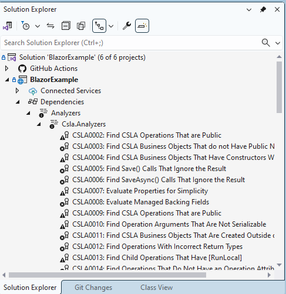
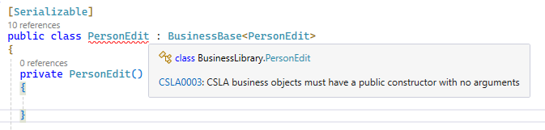
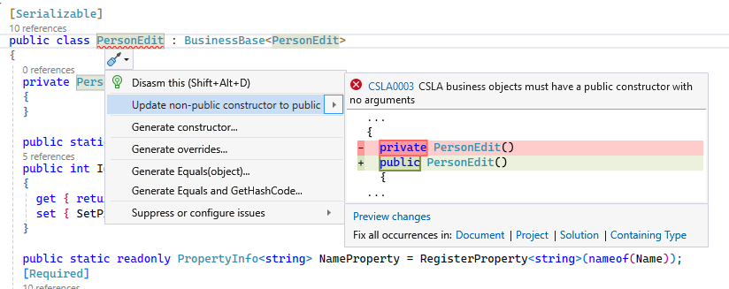
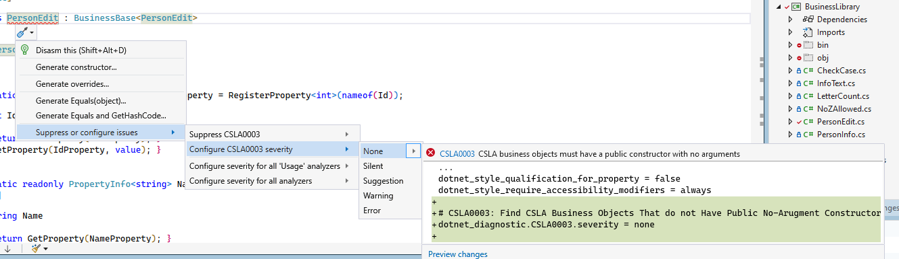
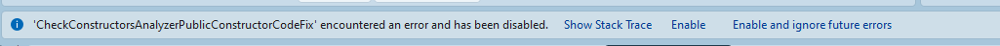

# Analyzers

With the 4.6 release of CSLA, a set of analyzers have been added to encourage and enforce patterns and idioms when using the CSLA framework. Let's go through the details on the analyzers.

## The Basics

When you add CSLA to your project via NuGet, you'll get a set of analyzers installed:

If you violate one of the rules, like making a business object that isn't serializable, you'll get an error or a warning:

Some of the analyzers have code fixes, which will automatically fix the issue for you:

## Unexpected Errors

While we try to make the analyzers as stable as we can, we may run into coding patterns that we didn't anticipate, which will cause the analyzers to fail. You can disable analyzers if they're causing too many issues for you by setting the severity to `None` (though we don't recommend you do this unless the analyzers are crashing):

In case of crash, analyzer or codefix display bar at the top of Editor. You can press button `Show Stack Trace`

Unfortunately, Visual Studio doesn't make it easy to get crash information on an analyzer. If you want provide more information in addition to stack trace, or something is more complicated, you can launch `devenv.exe` with the `/log` switch, and see if the log file contains any meaningful information. Also, please log an issue on the CSLA site if you do find problems with an analyzer, and we'll do our best to resolve the problem.

## Analyzer Proposals

If you have an idea for an analyzer that would be beneficial for developers using CSLA, please propose it in the forums (https://github.com/MarimerLLC/csla/discussions). Tag it with "feature discussion". If it's decided that it's a good idea to implement, it'll be moved to the CSLA issues list.

## Analyzer Error/Warning Messages

This is an [index of analyzer error/warning messages](analyzers/index.md)
