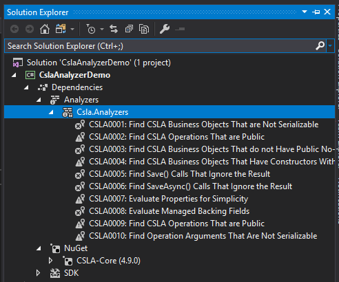
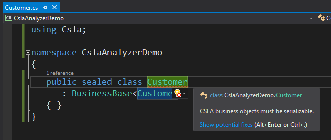
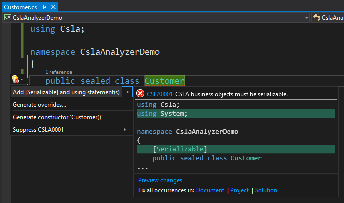
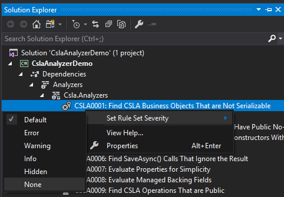

# Introduction
With the 4.6 release of CSLA, a set of analyzers have been added to encourage and enforce patterns and idioms when using the CSLA framework. Let's go through the details on the analyzers.
## The Basics
When you add CSLA to your project via NuGet, the analyzers will automatically be installed:

If you're building a project using csc.exe directly, you'll have to use the [`-analyzer` option](https://docs.microsoft.com/en-us/dotnet/csharp/language-reference/compiler-options/listed-alphabetically).

If you violate one of the rules, like making a business object that isn't serializable, you'll get an error or a warning:

Some of the analyzers have code fixes, which will automatically fix the issue for you:

## Unexpected Errors
While we try to make the analyzers as stable as we can, we may run into coding patterns that we didn't anticipate, which will cause the analyzers to fail. You can disable analyzers if they're causing too many issues for you by setting the severity to `None` (though we don't recommend you do this unless the analyzers are crashing):

Unfortunately, Visual Studio doesn't make it easy to get crash information on an analyzer. The best you can do is launch `devenv.exe` with the `/log` switch, and see if the log file contains any meaningful information. Also, please log an issue on the [CSLA site]((https://github.com/MarimerLLC/csla/issues)) if you do find problems with an analyzer, and we'll do our best to resolve the problem.
## Analyzer Proposals
If you have an idea for an analyzer that would be beneficial for developers using CSLA, please propose it in the [forums](https://github.com/MarimerLLC/cslaforum/issues), and tag it with "feature discussion".
## Analyzer Reference
* [CSLA0001](CSLA0001-IsBusinessObjectSerializableAnalyzer.md) - CSLA business objects must be serializable
* [CSLA0002](CSLA0002-IsOperationMethodPublicAnalyzer.md) - CSLA operations should not be public
* [CSLA0003](CSLA0003-CheckConstructorsAnalyzer.md) - CSLA business objects must have a public constructor with no arguments
* [CSLA0004](CSLA0004-CheckConstructorsAnalyzer.md) - CSLA business objects should not have public constructors with parameters
* [CSLA0005](CSLA0005-FindSaveAssignmentIssueAnalyzer.md) - Do not ignore the result of `Save()`
* [CSLA0006](CSLA0006-FindSaveAssignmentIssueAnalyzer.md) - Do not ignore the result of `SaveAsync()`
* [CSLA0007](CSLA0007-EvaluatePropertiesForSimplicityAnalyzer.md) - Properties that use managed backing fields should only use Get/Set/Read/Load methods
* [CSLA0008](CSLA0008-EvaluateManagedBackingFieldsAnalayzer.md) - Managed backing fields must be public, static and read-only
* [CSLA0009](CSLA0009-IsOperationMethodPublicAnalyzer.md) - CSLA operations should not be public on an interface
* [CSLA0010](CSLA0010-FindOperationsWithNonSerializableArgumentsAnalyzer.md) - Operation argument types should be serializable
* [CSLA0011](CSLA0011-FindBusinessObjectCreationAnalyzer.md) - CSLA business objects should not be created outside of an `ObjectFactory` instance
* [CSLA0012](CSLA0012-FindOperationsWithIncorrectReturnTypesAnalyzer.md) - The return type from an operation should be either `void` or `Task`
* [CSLA0013](CSLA0013-DoesChildOperationHaveRunLocalAnalyzer.md) - Child operations should not have `[RunLocal]`
* [CSLA0014](CSLA0014-DoesOperationHaveAttributeAnalyzer.md) - Operations should have the appropriate operation attribute
* [CSLA0015](CSLA0015-EvaluateOperationAttributeUsageAnalyzer.md) - Operation attributes should be used correctly
* [CSLA0016](CSLA0016-AsynchronousBusinessRuleInheritingFromBusinessRuleAnalyzer.md) - Asynchronous business rules should derive from `BusinessRuleAsync`
* [CSLA0017](CSLA0017-BusinessRuleDoesNotUseAddMethodsOnContextAnalyzer.md) - Business rules should use at least one `Add()` method on the context
* [CSLA0018](CSLA0018-IsCompleteCalledInAsynchronousBusinessRuleAnalyzer.md) - `Complete()` should not be called in an asynchronous business rule
* [CSLA0019](CSLA0019-FindRefAndOutParametersInOperationsAnalyzer.md) - Operations should not have `ref` or `out` parameters
* [CSLA0020](CSLA0020-ObjectAuthorizationRulesAttributeMissing.md) - Object authorization rules configuration should be marked with attribute
* [CSLA0021](CSLA0021-ObjectAuthorizationRulesPublic.md) - Object authorization rules configuration should be declared as public
* [CSLA0022](CSLA0022-ObjectAuthorizationRulesStatic.md) - Object authorization rules configuration should be declared as static
* [CSLA0024](CSLA0024-TypeWithOperationsShouldBePartialAnalyzer.md) - Types with data portal operation methods should be partial
* [CSLA0025](CSLA0025-UseGeneratedDataPortalExtensionAnalyzer.md) - Use the generated data portal extension method
