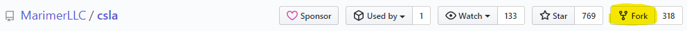
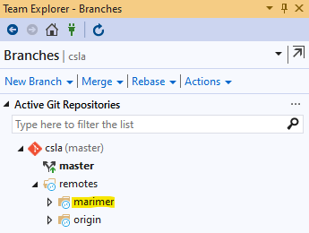
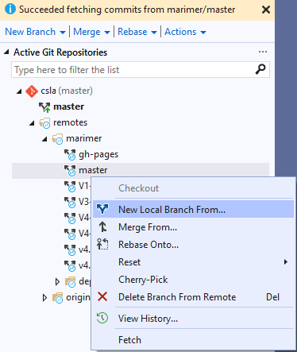
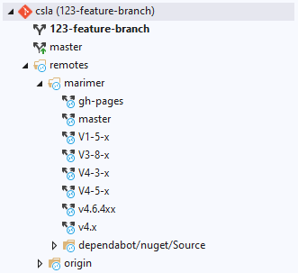
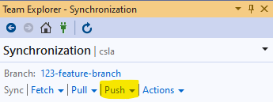
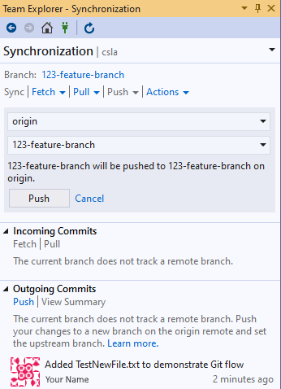

# Git Flow for CSLA Development using VS2019

In response to a lot of questions about how to work with git and GitHub when contributing to CSLA I wrote a blog post Simple Flow for Using Git and Pull Requests. That post is fairly long and includes explanations about why things work as they do.
Here's a tl;dr summary if you just want to get working without all the background.

## Getting started

1. Create a fork of MarimerLLC/csla using the GitHub web UI.
    a.  Go to <https://github.com/MarimerLLC/csla>.
    b. Click the fork button in the upper-right.

        

2. Clone your fork to your local workstation.
    a. Go to Team Explorer and click on the Manage Connections toolbar button.

        

    b. Click on Clone.

        

    c. Enter your CSLA repository URL and the local path for the cloned repository.

        

    d. Press Clone and wait while the files are copied from your GitHub fork to your local work area.

        

    e. When VS is finished cloning the files, they will be displayed in you Solution Explorer in Folder view.
    f. Your GitHub fork is now known as “origin” within your local clone. Since “origin” is the only remote you have defined, VS optimizes the use of space and creates a tree node called “remotes/origin”.

        

3. Add an upstream remote so your local clone has access to the "real" master (not just your fork).
    a. Click on Settings from the Team Explorer home menu.

        

    b. Click on Repository Settings from the Settings menu. You should see your GitHub repository listed as origin under Remotes.

        

    c. Click Add to open the Add Remote dialog box then enter the following values.

        

    d. Press Save to create the marimer remote.

                

4. Fetch the latest changed to the marimer remote-tracking branches.
    a. Select the Fetch menu option from the Team Explorer Synchronization then change the remote repo to marimer.

        

    b. Press the Fetch button.
    c. The marimer branches will now be listed in the Team Explorer – Branches area.

        

## Create a branch to do some work

1. Make sure your local marimer/master is up to date.
    a. Right click on the marimer/master branch and select Fetch from the context menu.

        

2. Create a local feature branch (work area)
    a. After you have successfully fetched the latest commits from the marimer/master, right click on your local master branch and select New Local Branch From… from the context menu.

        

    b. Enter the name of your new local feature branch.
        i. Make sure to leave the “Track remote branch” option UNCHECKED.

        

    c. Press Create Branch to copy the files to your local workspace.
    d. You now have a local feature branch based on the most recent marimer/master branch.

        

    e. It is good practice to run the unit tests at this point to ensure everything is working and establish a base line before making your changes.

## Create a branch to do some work against a maintenance branch

1. Follow the same steps as above but use the marimer/maintenance-branch-name instead of the marimer/master branch.
2. Important: when you submit your PR (later in this doc) make sure the target of your PR is maintenance-branch-name, not master

## Do your work

1. Edit code, and do other stuff
2. Commit your changes to your local clone
    a. Working with Git within VS2019 is beyond the scope of this document. For now, we will assume a single change and a commit all.
    b. In Team Explorer – Changes, enter the commit comment and press Commit All.

        

3. Rinse and repeat as you work.
    a. It is a good idea to commit frequently so you can roll back to a previous state in case of badness.
    b. Committing only updates your local clone, it has no impact on anything in the cloud until you push (next step).
4. Watch for changes from the marimer source branch.
    a. Right click on the marimer/branch that was the source of your local feature branch and press Fetch. This does not update your local branch. It only updates your local repository.
    b. Right click on you feature branch and select “Merge From…” from the context menu. This will update your local branch with changes that have been made to marimer/branch. This is how you keep your local branch up to date.

## Upload your work to the cloud

1. Push your local clone to your GitHub fork
    a. Open the Team Explorer Synchronization area.
    b. Select the Push Sync menu option.

        

    c. Set the remote to origin and the branch to the name of your feature branch. Then press the Push button.

        

    d. Your GitHub fork now has a copy of your feature branch from your local clone.
    e. You can push your local clone to GitHub as often as you'd like, this acts as a backup, and allows for collaboration (other people can see your changes via the GitHub web UI)

## Create a Pull Request (PR)

1. Make sure your feature branch is current with the marimer source branch.
    a. Right click on the marimer/branch that was the source of your local feature branch and press Fetch.
    b. Right click on you feature branch and select “Merge From…” from the context menu. This will update your local branch with changes that have been made to marimer/branch.
    c. You may need to resolve merge conflicts. How to work with VS2019 to resolve merge conflicts is beyond the scope of this document.
    d. Make sure your updated/merged feature branch still builds.
    e. Make sure your unit tests still pass.
    f. Follow the steps in the previous section to upload your work to the cloud.
2. Create a PR from your GitHub fork to MarimerLLC/csla.
    a. Use the GitHub web UI to create a PR from your fork to MarimerLLC/csla.
    b. Navigate to your fork and branch in GitHub, then click the button to create a pull request, the defaults should be correct.
    c. Double-check to make sure MarimerLLC/csla-master is on the left, and yourname/csla-yourbranch is on the right.
    d. Creating the PR will trigger a CI build.
        i. We will only accept a PR if it can be automatically merged (green checkmark).
        ii. We will only accept a PR if the build/tests all pass (green checkmark from CI build).
    e. Your PR has no effect on master or production, it is a pending change.
    f. Subsequent changes to your feature branch in your GitHub fork automatically become part of your PR; each time you push to your GitHub fork's feature branch triggers a CI build of the PR.

## React to review comments on your PR

1. People can comment on, or review your PR, indicating changes you need to make before it is accepted.
    a. This is a dialog so please engage with the reviewer(s) as appropriate.
2. Edit code or other stuff in your feature branch on your local clone.
3. Commit your changes to your local clone.
4. Push your local clone to your GitHub fork.
    a. Any changes pushed to the feature branch in your GitHub fork are automatically incorporated into your PR (and a CI build is triggered).

## Cleanup after PR acceptance/rejection

1. Remove feature branch in your GitHub fork.
    a. Use the GitHub web UI to remove the feature branch.
2. Remove feature branch in your local clone.
    a. Ensure your local feature branch has no uncommitted changes.
    b. Right click on your local master branch and select Checkout from the context menu.
    c. Right click on your local feature branch and select Delete from the context menu.

## Ask other people to collaborate on your PR

I'm not going to repeat all the commands here - they are the same as the steps above, but using your GitHub repo as the "upstream" instead of using MarimerLLC/csla as the upstream.

1. Have other person create a fork from your fork using GitHub web UI.
2. Have other person clone their fork to their workstation.
3. Have other person add your fork as an upstream remote to their local clone.
4. Have other person update their local clone from your fork.
5. Have other person create working branch based on your feature branch.
6. Have other person do their code or other changes.
7. Have other person commit changes to their local clone.
8. Have other person push their local clone to their fork.
9. Have other person create a PR from their fork to your fork.
10. Accept their PR to merge their changes to your fork's feature branch (which automatically updates your PR and triggers a CI build).
